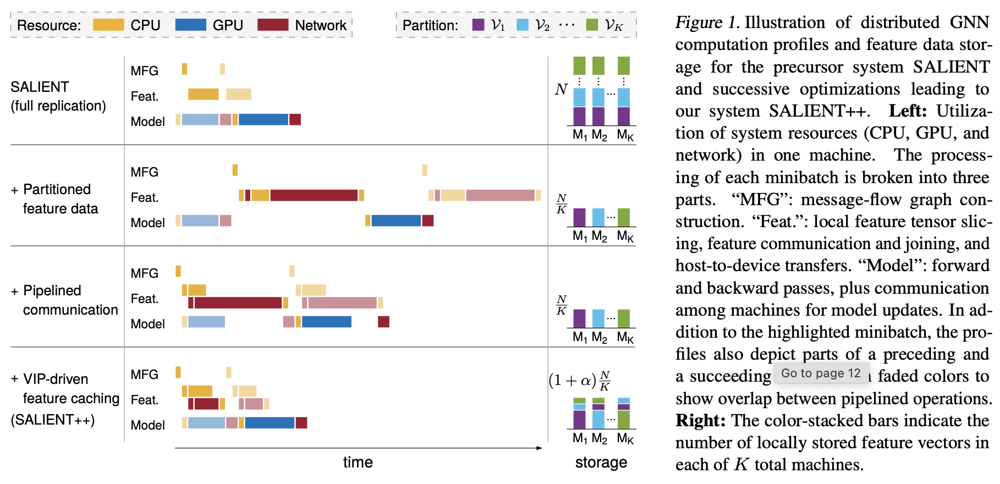

SALIENT++
=========

SALIENT++ is a distributed multi-GPU training and inference system for graph neural networks (GNNs), targeting at massive graphs. It effectively mitigates (and with sufficient memory bandwidth, nearly eliminates) the bottleneck of a PyTorch workflow on mini-batch generation and transfer, as well as significantly reduces feature communication caused by multi-hop neighborhood expansion, rendering the overall training/inference time dominated by GPU computation. The system is described in the paper [Communication-Efficient Graph Neural Networks with Probabilistic Neighborhood Expansion Analysis and Caching](https://arxiv.org/abs/2305.03152) published at MLSys 2023. This repository contains the codes of SALIENT++.

SALIENT++ is a successor of [SALIENT](https://github.com/MITIBMxGraph/SALIENT), which replicates the node feature matrix on each machine. SALIENT++ partitions the node feature matrix and additionally caches frequently accessed out-of-partition features, reducing the memory consumption of SALIENT while retaining its efficeincy.



## Setup and Example Usage

SALIENT++ can be run on a machine with one or multiple GPUs or on a GPU cluster.

* See this [INSTALL](docs/INSTALL.md) for instructions to setup the system on a typical x86_64 machine or cluster.
* See this [INSTALL](docs/INSTALL_Satori.md) for instructions to setup the system on the Satori cluster.

Example usage of SALIENT++ is given together with the instructions.

## Extension

SALIENT++ is designed to be fully compatible with PyG. In particular, defining a GNN architecture is done the same way as writing a usual PyG code.

* See this [README](docs/README_architecture.md) for instructions to add a GNN architecture.
* See this [README](docs/README_dataset.md) for instructions to add a dataset.

## Artifacts

While this repository is being maintained, a frozen version that reproduces the key results in the paper can be found in a separate [artifact repository](https://github.com/MITIBMxGraph/SALIENT_plusplus_artifact).

## Reference

Please cite these papers if you use the codes in your work:

```
@INPROCEEDINGS{Kaler2023.SALIENT++,
  AUTHOR = {Tim Kaler and Alexandros-Stavros Iliopoulos and Philip Murzynowski and Tao B. Schardl and Charles E. Leiserson and Jie Chen},
  TITLE = {Communication-Efficient Graph Neural Networks with Probabilistic Neighborhood Expansion Analysis and Caching},
  BOOKTITLE = {Proceedings of Machine Learning and Systems 5},
  YEAR = {2023},
}

@INPROCEEDINGS{Kaler2022.SALIENT,
  AUTHOR = {Tim Kaler and Nickolas Stathas and Anne Ouyang and Alexandros-Stavros Iliopoulos and Tao B. Schardl and Charles E. Leiserson and Jie Chen},
  TITLE = {Accelerating Training and Inference of Graph Neural Networks with Fast Sampling and Pipelining},
  BOOKTITLE = {Proceedings of Machine Learning and Systems 4},
  YEAR = {2022},
}
```

## Contributors

SALIENT++ is developed by the xGraph team at the MIT-IBM Watson AI Lab.


## Acknowledgements
This research was sponsored by MIT-IBM Watson AI Lab and in part by the United States Air Force Research Laboratory and the United States Air Force Artificial Intelligence Accelerator and was accomplished under Cooperative Agreement Number FA8750-19-2-1000. The views and conclusions contained in this document are those of the authors and should not be interpreted as representing the official policies, either expressed or implied, of the United States Air Force or the U.S. Government. The U.S. Government is authorized to reproduce and distribute reprints for Government purposes notwithstanding any copyright notation herein.
